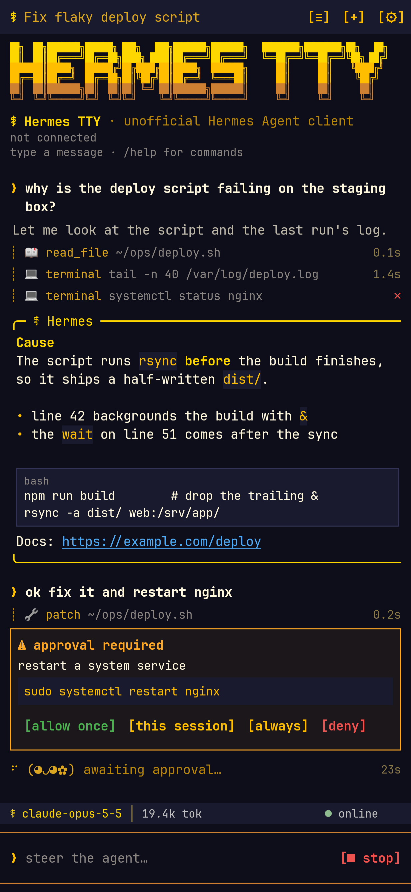
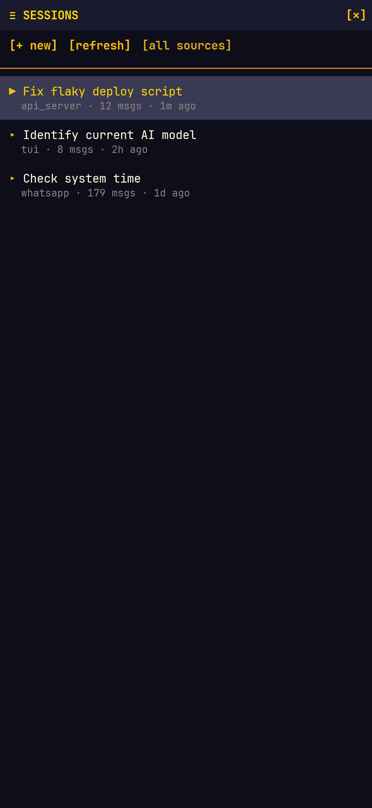
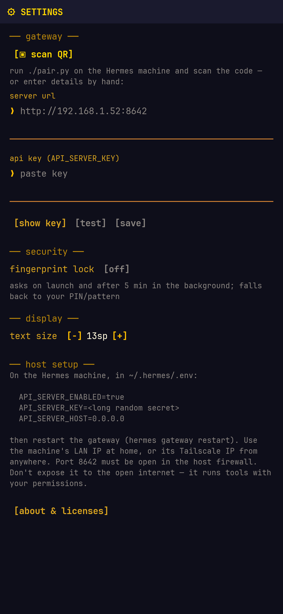

# Hermes TTY

A tiny Android terminal for talking to your own [Hermes Agent](https://github.com/NousResearch/hermes-agent)
from your phone. No SSH, no chat-app bridge — it speaks directly to the gateway's built-in API server,
styled after the Hermes CLI's default "gold & kawaii" skin.

> **Unofficial.** Hermes TTY is an independent project. It is not affiliated with, endorsed by, or
> supported by Nous Research. "Hermes" and "Hermes Agent" are used only to describe what it connects to.
> See [THIRD_PARTY_NOTICES.md](THIRD_PARTY_NOTICES.md).

<p>
  
  
  
</p>

## Requirements

- Android 8.0 (API 26) or newer.
- Hermes Agent **v2026.8.13 or newer** on the machine you want to reach. Older gateways back to at
  least v2026.5.29 work, but can't be steered mid-turn.

## Host setup (once)

In `~/.hermes/.env` on the machine running Hermes:

```
API_SERVER_ENABLED=true
API_SERVER_KEY=<long random secret>
API_SERVER_HOST=0.0.0.0        # default 127.0.0.1 is unreachable from the phone
```

Then `hermes gateway restart`, and open TCP 8642 in the firewall (Fedora:
`sudo firewall-cmd --add-port=8642/tcp --permanent && sudo firewall-cmd --reload`).

> [!WARNING]
> The API key grants the same power as a terminal on that machine. **Never port-forward 8642 to the
> internet.** Reach it at `http://<LAN-IP>:8642` at home, or install [Tailscale](https://tailscale.com)
> on both machines and use the tailnet IP from anywhere. Plain `http://` on a LAN sends the key
> unencrypted over your Wi-Fi; Tailscale encrypts it. The app warns when an address looks exposed.

### Pair by QR code

```
./pair.py              # uses this machine's LAN IP
./pair.py 100.x.y.z    # or your Tailscale IP / MagicDNS name
```

It prints a QR code in the terminal (the code contains the API key — only show it on a screen you
trust). In the app, tap **[▣ scan QR]** in settings, then confirm the server it shows.

## Install

Download the APK from [Releases](https://github.com/planetwally/hermes-tty/releases), check its
SHA-256 against the release notes, and sideload it. Or build it yourself (below).

## Using it

- First launch opens **settings**: scan the pairing QR code, or enter server URL + API key → `[test]` → `[save]`.
- Type and send. Tool calls stream in as `┊` lines, answers land in the gold `Hermes` box,
  dangerous commands pop an approval card (`allow once / this session / always / deny`).
- Typing while a turn runs **steers** it; `[■ stop]` interrupts.
- `[≡]` lists all sessions (TUI, WhatsApp, API…) to resume; `[+]` starts a new one.
- Commands: `/new /sessions /stop /title <name> /reload /clear /settings /about /help`.
- The app locks behind your fingerprint / screen lock on launch and after 5 minutes in the background.

Turns use the Runs API (`POST /v1/runs` + SSE events). If the phone sleeps or switches networks
mid-turn, the agent keeps working; the app polls the run and reloads the transcript when it finishes.

### Security notes

- The API key is encrypted at rest with a non-exportable Android Keystore key and excluded from backups.
- `hermestty://connect` pairing links never apply silently: the app always shows the server and asks first.
- The QR scanner (ZXing) asks for camera permission the first time you scan; nothing else needs permissions
  beyond network access.

Found a vulnerability? See [SECURITY.md](SECURITY.md).

## Build

Needs JDK 17–24 to run Gradle (Gradle 8.14 can't run on JDK 25+) and the Android SDK
(`ANDROID_HOME` or `sdk.dir` in `local.properties`). If your default JDK is newer, point Gradle
at an older one in `~/.gradle/gradle.properties`: `org.gradle.java.home=/path/to/jdk21`.

```
./gradlew :app:assembleRelease   # app/build/outputs/apk/release/app-release.apk
./gradlew :app:testDebugUnitTest # unit tests; renders screens to app/build/screens/
```

The screenshot test also runs a live turn against `127.0.0.1:8642` when `~/.hermes/.env` has an
`API_SERVER_KEY`, and skips it otherwise.

### Release signing

Without a release key, release builds are signed with the debug key (fine for local installs, not
for publishing). To sign properly, create `keystore.properties` in the project root (git-ignored):

```
storeFile=/absolute/path/to/release.jks
storePassword=...
keyAlias=hermestty
keyPassword=...
```

or set `HERMESTTY_KEYSTORE`, `HERMESTTY_KEYSTORE_PASSWORD`, `HERMESTTY_KEY_ALIAS` and
`HERMESTTY_KEY_PASSWORD`. Keep the keystore backed up: Android only installs updates signed
with the same key.

## License

[MIT](LICENSE) © 2026 Wally ([planetwally.com](https://planetwally.com)). Bundled JetBrains Mono is
under the [SIL Open Font License 1.1](FONT-LICENSE-OFL.txt); other components are listed in
[THIRD_PARTY_NOTICES.md](THIRD_PARTY_NOTICES.md).
